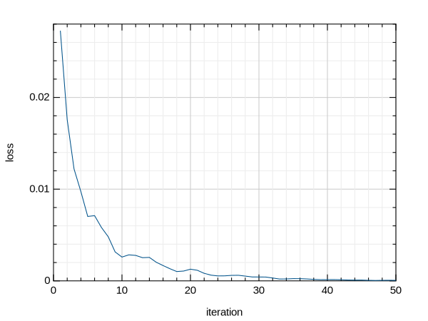
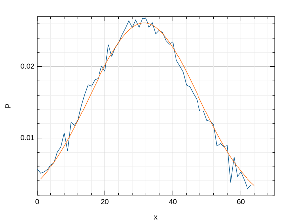

# Quantum Circuit Born Machine

Quantum circuit born machine is a fresh approach to quantum machine learning. It use a parameterized quantum circuit to learning machine learning tasks with gradient based optimization. In this tutorial, we will show how to implement it with **Yao** (幺) framework.

about the framework


```@repl QCBM
using Yao # hide
@doc 幺
```

## Training target
a gaussian distribution

```@example QCBM
function gaussian_pdf(n, μ, σ)
    x = collect(1:1<<n)
    pl = @. 1 / sqrt(2pi * σ^2) * exp(-(x - μ)^2 / (2 * σ^2))
    pl / sum(pl)
end
```

```math
f(x \left| \mu, \sigma^2\right) = \frac{1}{\sqrt{2\pi\sigma^2}} e^{-\frac{(x-\mu)^2}{2\sigma^2}}
```

```@example QCBM
const n = 6
const maxiter = 20
pg = gaussian_pdf(n, 2^5-0.5, 2^4)
nothing # hide
```

```julia
fig = plot(0:1<<n-1, pg)
```


## Build Circuits

### Building Blocks

Gates are grouped to become a layer in a circuit, this layer can be **Arbitrary Rotation** or **CNOT entangler**. Which are used as our basic building blocks of **Born Machines**.


#### Arbitrary Rotation

Arbitrary Rotation is built with **Rotation Gate on Z**, **Rotation Gate on X** and **Rotation Gate on Z**:


```math
Rz(\theta) \cdot Rx(\theta) \cdot Rz(\theta)
```

Since our input will be a ``|0\dots 0\rangle`` state. The first layer of arbitrary rotation can just use ``Rx(\theta) \cdot Rz(\theta)`` and the last layer of arbitrary rotation could just use ``Rz(\theta)\cdot Rx(\theta)``


In **幺**, every Hilbert operator is a **block** type, this includes all **quantum gates** and **quantum oracles**. In general, operators appears in a quantum circuit can be divided into **Composite Blocks** and **Primitive Blocks**.

We follow the low abstraction principle and thus each block represents a certain approach of calculation. The simplest **Composite Block** is a **Chain Block**, which chains other blocks (oracles) with the same number of qubits together. It is just a simple mathematical composition of operators with same size. e.g.

```math
\text{chain(X, Y, Z)} \iff X \cdot Y \cdot Z
```

We can construct an arbitrary rotation block by chain ``Rz``, ``Rx``, ``Rz`` together.

```@repl QCBM
chain(Rz(0), Rx(0), Rz(0))
```

`Rx`, `Ry` and `Rz` will construct new rotation gate, which are just shorthands for `rot(X, 0.0)`, etc.

Then, let's pile them up vertically with another method called **rollrepeat**

```@example QCBM
layer(x::Symbol) = layer(Val(x))
layer(::Val{:first}) = rollrepeat(chain(Rx(0), Rz(0)))
```

In **幺**, the factory method **rollrepeat** will construct a block called **Roller**. It is mathematically equivalent to the kronecker product of all operators in this layer:

```math
rollrepeat(n, U) \iff roll(n, \text{i=>U for i = 1:n}) \iff kron(n, \text{i=>U for i=1:n}) \iff U \otimes \dots \otimes U
```

```@repl QCBM
roll(4, i=>X for i = 1:4)
```

```@repl QCBM
rollrepeat(4, X)
```

```@repl QCBM
kron(4, i=>X for i = 1:4)
```

However, `kron` is calculated differently comparing to `roll`. In principal, **Roller** will be able to calculate small blocks with same size with higher efficiency. But for large blocks **Roller** may be slower. In **幺**, we offer you this freedom to choose the most suitable solution.


all factory methods will **lazy** evaluate **the first arguements**, which is the number of qubits. It will return a lambda function that requires a single interger input. The instance of desired block will only be constructed until all the information is filled.

```@repl QCBM
rollrepeat(X)
```

```@repl QCBM
rollrepeat(X)(4)
```

When you filled all the information in somewhere of the declaration, 幺 will be able to infer the others.

```@repl QCBM
chain(4, rollrepeat(X), rollrepeat(Y))
```

We will now define the rest of rotation layers

```@example QCBM
layer(::Val{:last}) = rollrepeat(chain(Rz(0), Rx(0)))
layer(::Val{:mid}) = rollrepeat(chain(Rz(0), Rx(0), Rz(0)))
```

#### CNOT Entangler

Another component of quantum circuit born machine is several **CNOT** operators applied on different qubits.

```@example QCBM
entangler(pairs) = chain(control([ctrl, ], target=>X) for (ctrl, target) in pairs)
```

We can then define such a born machine

```@example QCBM
function QCBM(n, nlayer, pairs)
    circuit = chain(n)
    push!(circuit, layer(:first))

    for i = 1:(nlayer - 1)
        push!(circuit, cache(entangler(pairs)))
        push!(circuit, layer(:mid))
    end

    push!(circuit, cache(entangler(pairs)))
    push!(circuit, layer(:last))

    circuit
end
nothing # hide
```

We use the method `cache` here to tag the entangler block that it should be cached after its first run, because it is actually a constant oracle. Let's see what will be constructed

```@repl QCBM
QCBM(4, 1, [1=>2, 2=>3, 3=>4])
```

Let's define a circuit to use later

```@example QCBM
circuit = QCBM(6, 10, [1=>2, 3=>4, 5=>6, 2=>3, 4=>5, 6=>1])
nothing # hide
```

## MMD Loss & Gradients

The MMD loss is describe below:

```math
\begin{aligned}
\mathcal{L} &= \left| \sum_{x} p \theta(x) \phi(x) - \sum_{x} \pi(x) \phi(x) \right|^2\\
            &= \langle K(x, y) \rangle_{x \sim p_{\theta}, y\sim p_{\theta}} - 2 \langle K(x, y) \rangle_{x\sim p_{\theta}, y\sim \pi} + \langle K(x, y) \rangle_{x\sim\pi, y\sim\pi}
\end{aligned}
```


We will use a squared exponential kernel here.


```@example QCBM
struct Kernel
    sigma::Float64
    matrix::Matrix{Float64}
end

function Kernel(nqubits, sigma)
    basis = collect(0:(1<<nqubits - 1))
    Kernel(sigma, kernel_matrix(basis, basis, sigma))
end

expect(kernel::Kernel, px::Vector{Float64}, py::Vector{Float64}) = px' * kernel.matrix * py
loss(qcbm, kernel::Kernel, ptrain) = (p = get_prob(qcbm) - ptrain; expect(kernel, p, p))
nothing # hide
```

Next, let's define the kernel matrix

```@example QCBM
function kernel_matrix(x, y, sigma)
    dx2 = (x .- y').^2
    gamma = 1.0 / (2 * sigma)
    K = exp.(-gamma * dx2)
    K
end
nothing # hide
```

### Gradients


the gradient of MMD loss is

```math
\begin{aligned}
\frac{\partial \mathcal{L}}{\partial \theta^i_l} &= \langle K(x, y) \rangle_{x\sim p_{\theta^+}, y\sim p_{\theta}} - \langle K(x, y) \rangle_{x\sim p_{\theta}^-, y\sim p_{\theta}}\\
&- \langle K(x, y) \rangle _{x\sim p_{\theta^+}, y\sim\pi} + \langle K(x, y) \rangle_{x\sim p_{\theta^-}, y\sim\pi}
\end{aligned}
```

We have to update one parameter of each rotation gate each time, and calculate its gradient then collect them. Since we will need to calculate the probability from the state vector frequently, let's define a shorthand first.


Firstly, you have to define a quantum register. Each run of a QCBM's input is a simple ``|00\cdots 0\rangle`` state. We provide string literal `bit` to help you define one-hot state vectors like this

```@repl QCBM
r = register(bit"0000")
```


Now, we define its shorthand

```julia
get_prob(qcbm) = with!(qcbm, register(bit"0"^6)) |> statevec .|> abs2
```

We will first iterate through each layer contains rotation gates and allocate an array to store our gradient

```julia
function gradient(n, nlayers, qcbm, kernel, ptrain)
    prob = get_prob(qcbm)
    grad = zeros(real(datatype(qcbm)), nparameters(qcbm))
    idx = 0
    for ilayer = 1:2:(2 * nlayers + 1)
        idx = grad_layer!(grad, idx, prob, qcbm, qcbm[ilayer], kernel, ptrain)
    end
    grad
end
```

Then we iterate through each rotation gate.

```julia
function grad_layer!(grad, idx, prob, qcbm, layer, kernel, ptrain)
    count = idx
    for each_line in blocks(layer)
        for each in blocks(each_line)
            gradient!(grad, count+1, prob, qcbm, each, kernel, ptrain)
            count += 1
        end
    end
    count
end
```

We update each parameter by rotate it ``-\pi/2`` and ``\pi/2``

```julia
function gradient!(grad, idx, prob, qcbm, gate, kernel, ptrain)
    dispatch!(+, gate, pi / 2)
    prob_pos = get_prob(qcbm)

    dispatch!(-, gate, pi)
    prob_neg = get_prob(qcbm)

    dispatch!(+, gate, pi / 2) # set back

    grad_pos = expect(kernel, prob, prob_pos) - expect(kernel, prob, prob_neg)
    grad_neg = expect(kernel, ptrain, prob_pos) - expect(kernel, ptrain, prob_neg)
    grad[idx] = grad_pos - grad_neg
    grad
end
```

## Optimizer

We will use the Adam optimizer. Since we don't want you to install another package for this, the following code for this optimizer is copied from [Knet.jl](https://github.com/denizyuret/Knet.jl)

Reference: [Kingma, D. P., & Ba,
J. L. (2015)](https://arxiv.org/abs/1412.6980). Adam: a Method for
Stochastic Optimization. International Conference on Learning
Representations, 1–13.

```julia
using LinearAlgebra

mutable struct Adam
    lr::AbstractFloat
    gclip::AbstractFloat
    beta1::AbstractFloat
    beta2::AbstractFloat
    eps::AbstractFloat
    t::Int
    fstm
    scndm
end

Adam(; lr=0.001, gclip=0, beta1=0.9, beta2=0.999, eps=1e-8)=Adam(lr, gclip, beta1, beta2, eps, 0, nothing, nothing)

function update!(w, g, p::Adam)
    gclip!(g, p.gclip)
    if p.fstm===nothing; p.fstm=zeros(w); p.scndm=zeros(w); end
    p.t += 1
    lmul!(p.beta1, p.fstm)
    BLAS.axpy!(1-p.beta1, g, p.fstm)
    lmul!(p.beta2, p.scndm)
    BLAS.axpy!(1-p.beta2, g .* g, p.scndm)
    fstm_corrected = p.fstm / (1 - p.beta1 ^ p.t)
    scndm_corrected = p.scndm / (1 - p.beta2 ^ p.t)
    BLAS.axpy!(-p.lr, @.(fstm_corrected / (sqrt(scndm_corrected) + p.eps)), w)
end

function gclip!(g, gclip)
    if gclip == 0
        g
    else
        gnorm = vecnorm(g)
        if gnorm <= gclip
            g
        else
            BLAS.scale!(gclip/gnorm, g)
        end
    end
end
```

## Start Training

The training of the quantum circuit is simple, just iterate through the steps.

```julia
function train!(qcbm, ptrain, optim; learning_rate=0.1, niter=50)
    # initialize the parameters
    params = 2pi * rand(nparameters(qcbm))
    dispatch!(qcbm, params)
    kernel = Kernel(nqubits(qcbm), 0.25)

    n, nlayers = nqubits(qcbm), (length(qcbm)-1)÷2
    history = Float64[]

    for i = 1:niter
        grad = gradient(n, nlayers, qcbm, kernel, ptrain)
        curr_loss = loss(qcbm, kernel, ptrain)
        push!(history, curr_loss)        
        params = parameters(qcbm)
        update!(params, grad, optim)
        dispatch!(qcbm, params)
    end
    history
end
```

```julia
optim = Adam(lr=0.1)
his = train!(circuit, pg, optim, niter=50, learning_rate=0.1)
plot(1:50, his, xlabel="iteration", ylabel="loss")
```



```julia
p = get_prob(circuit)
plot(0:1<<n-1, p, pg, xlabel="x", ylabel="p")
```



